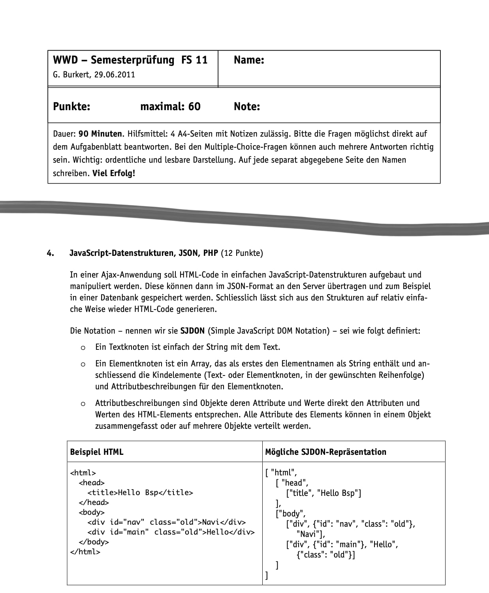

# SJDON 

## Introduction

SJDON means **Simple JavaScript DOM Notation**. It is a simple notation for DOM structures in JavaScript that I introduced in the course _Web Publishing and Web Design_ at ZHAW (Zurich University of Applied Sciences) in 2011. It has some similarities to approaches like [HyperScript](https://github.com/hyperhype/hyperscript). 

Meanwhile, this notation is being used in an mini framework for teaching purposes. It ist called SuiWeb, a
**Simple User Interface Tool for Web Exercises**, that can be characterized as React extra light.

Currently, there is only this discription in the project. Code for SuiWeb will soon be added.

Gerrit Burkert

 


## Features

### JSX and SJDON

As a representation for elements, JSX and a representation called SJDON can be used.

Example:

```js
import { render, createElement } from "./suiweb.js";     

/** @jsx createElement */ /*
const element = (
  <div style="background: salmon">
    <h1>Hello World</h1>
    <h2 style="text-align:right">from SuiWeb</h2>
  </div>
);

const container = document.getElementById("root");
render(element, container);
```

JSX has to be converted to JavaScript. Using Babel, the output is:

```js
import { render, createElement } from "./suiweb.js";     

/** @jsx createElement */
const element = createElement("div", {
  style: "background: salmon"
}, createElement("h1", null, "Hello World"), createElement("h2", {
  style: "text-align:right"
}, "from SuiWeb"));

const container = document.getElementById("root");
render(element, container);
```

As an alternative, SJDON can be used to represent elements. More on SJDON below. The example in SJDON representation:

```js
import { render } from "./suiweb.js";     

const element =
  ["div", {style: "background: salmon"},
    ["h1", "Hello World"],
    ["h2", {style: "text-align:right"}, "from SuiWeb"] ];

const container = document.getElementById("root");
render(element, container);
```

It is readable and, **in contrast to JSX, it is plain JavaScript**.

### SJDON Description

An element in SJDON is an array. The first item in the array is the node: If it is a string, it creates a DOM node with this type (name of an HTML element). If it is a function, it represents a function component that will be called while rendering the element. The other array items are child nodes or properties. Properties are objects that can occur at any place in the array (excluding index 0). All property objects are merged together. Other array items are child nodes: arrays represent subtrees, other types represent text nodes. That's it :)

**Examples**

A simple element:  
`["br"]`

An element with child elements:  
`["ul", ["li", "eins"],  ["li", "zwei"]]`

An element with properties:  
`["p", {class: "intro"}, "Hello world"]`

Same as above:  
`["p", "Hello world", {class: "intro"}]`

Variables or functions can appear almost everywhere: it's just JavaScript.

```js
// JSX
const element = (
  <div style="background: salmon">
    <h1>Hello World</h1>
    <h2 style="text-align:right">from SuiWeb</h2>
  </div>
);

// SJDON
const element =
  ["div", {style: "background: salmon"},
    ["h1", "Hello World"],
    ["h2", {style: "text-align:right"}, "from SuiWeb"] ];
```


### Function Components

Components are defined as functions on the properties. When a function component is rendered, the function is eveluated and the result will be rendered instead. 

```js
const App = ({name}) =>
  ["h1", "Hi ", name];
  
const element =
  [App, {name: "SuiWeb"}];
```

### Mapping Over Lists

Lists can simply be mapped to `li`-items and included in an element tree.

```js
const App = ({items}) =>
  ["ul", ...items.map((item) => ["li", {style}, item]) ];

const element = 
  [App, {items: ["milk", "bread", "sugar"]}];
```

### Styles

Style attributes are supported in various ways:

* A CSS style string will replace the DOM style attribute
* An object will be merged into the DOM style attribute
* An array of objects will be merged into the DOM style attribute

The latter allows for merging current styles from properties or component state into predefined default component styles.

```js
const App = ({items}) => {
  let style = [styles.listitem, {color: "#556B2F"}];
  return (
    ["ul", ...items.map((item) => ["li", {style}, item]) ]
  );
}

const element = 
  [App, {items: ["milk", "bread", "sugar"]}];

const styles = {
  listitem: {
    padding: "1em",
    margin: "0.5em 2em",
    fontSize: "1.5em",
    listStyleType: "none",
    border: "1px solid blue",
    borderRadius: "5px",
    background: "#efe",
  }
}
```

### Function Components With Children

In the example, `MyButton` and `Header` have children that are included in the element tree generated by these function components.

```js
const MyButton = (props) =>
  ["button", {style: "background: khaki"}, ...props.children];

const Header = (props) => {
  return ["h2", "Hello ", props.name, ...props.children];
}
const App = (props) =>
  ["div",
    [Header, {name: props.name}, " and", ["br"], "web developers"],
    [MyButton, "Start"],
    [MyButton, "Stop"] ];

const element = [App, {name: "SuiWeb"}];
```

### Passing Sub Trees

Element trees can also be the value of a property and can be included where needed.

```js
const Main = ({header, name}) =>
  ["div",
    [...header, name],
    ["p", "Welcome to SuiWeb"] ];

const App = ({header}) =>
  [Main, {header, name: "web developers"}];

const element = [App, {header: ["h2", "Hello "]}];
```

### Numeric Properties

Properties can be numbers.

```js
const App = ({num1, num2}) =>
  ["h1", num1, " * ", num2, " = ", num1*num2];

const element = [App, {num1: 3, num2: 9}];
```

### Components With State

State is supported in function components using hooks. A state hook is created by calling the function `useState` and providing three arguments:

* An id to distiguuish multiple state hooks in the same component.
* A key used to distinguish multiple instances (calls) of this component.
* An initial value.

In React.js, `useState` has only one argument, the initial value. 

A call to `useState` returns an array with two items: the current state value and a function to update the state. The update function must be called with a function that returns the new state. If the update function is called the component will be re-rendered. The re-rendering can be suppressed by providing a second argument with the boolean `false`.

In addition to the _state hook_, an _effect hook_ is supported. When given a function, this function will be called after rendering the component. Since all rendering is done synchroneously in SuiWeb, effect hooks are not really necessary, however (callbacks are not called before rendering is complete).

```js
const Counter = (props) => {
  
  //  add state hook
  let [count, setCount] = useState("mycounter", props.key, props.count);
  let [timer, setTimer] = useState("mytimer", props.key, null);
  
  useEffect(() => {
    if (timer) clearTimeout(timer);
    setTimer(() => setTimeout(()=>setCount(n => n+1), 1000), false);
  });
  
  return (
    ["p", 
      {style: "font-size:2em", onclick: ()=>setCount(n => n+1)}, 
      "Count ", count ]
  );
}

const App = (props) =>
  ["div",
    [Counter, {count: 1, key: 1}],
    [Counter, {count: 4, key: 2}],
    [Counter, {count: 7, key: 3}] ];
  
const element =
  [App];
```

### Controlled Input Elements

This example shows how state hooks can be used to store the current state of input elements. The input elements display the current state. So the state is _the single source of truth_ for the input elements. 

```js
const App = ({init}) => {
  
  let [text, setText] = useState("myTextInput", 1, init);
  let [otherText, setOtherText] = useState("myOther Text", 1, "");
  
  const updateValue = e => {
    setText(() => e.target.value);
  }
  const updateOtherValue = e => {
    setOtherText(() => e.target.value);
  }
  
  return (
    ["div", {style: "background: lightblue"},
      ["h1", "Controlled Input Elements"],
      ["input", {oninput: updateValue, value: text}],
      ["p", "Your input: ", text ],
      ["textarea", {oninput: updateOtherValue}, otherText],
      ["p", "Your input: ", otherText ] ] 
  );
}

const element = [App, {init: "Name"}];
```


